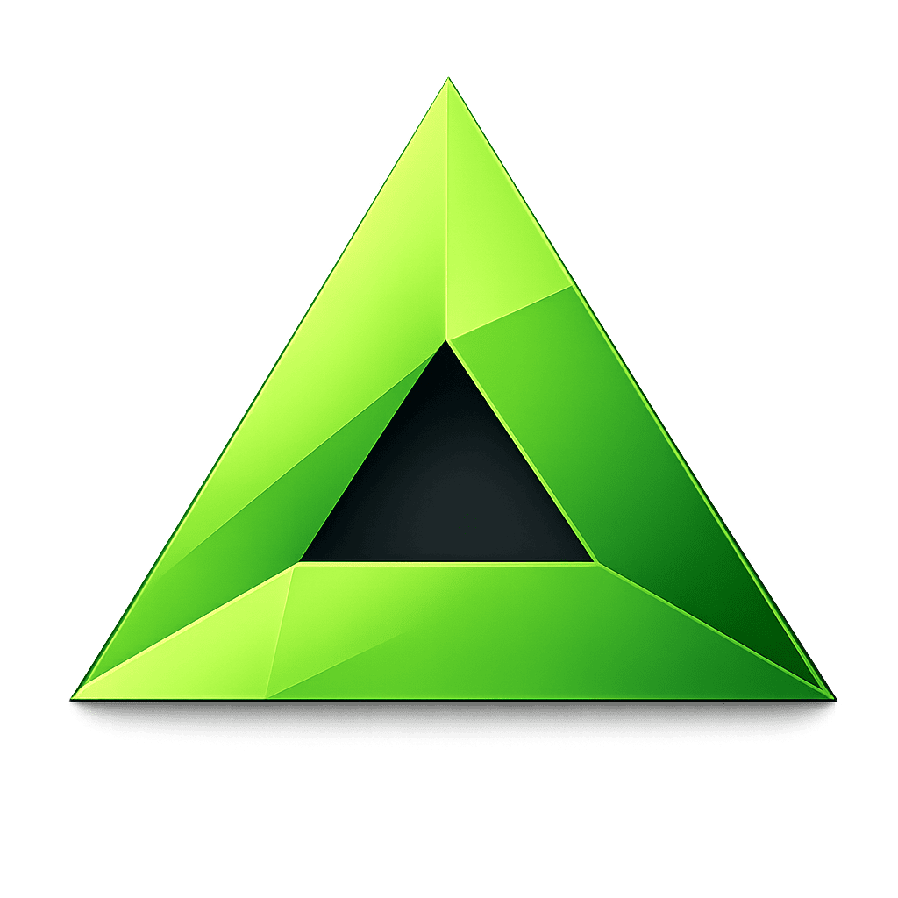

<p align="center">
  
</p>

<h1 align="center">Game-Servum</h1>

<p align="center">
  <strong>Professional Game Server Management</strong>
  </br>
  <strong>Manage DayZ, 7 Days to Die, ARK, and other dedicated game servers from a modern Commander — locally or across multiple machines<strong>
</p>

<p align="center">
  <a href="https://github.com/xscr33m/Game-Servum/releases/latest">
    
  </a>
  <a href="https://github.com/xscr33m/Game-Servum/releases">
    
  </a>
  <a href="LICENSE">
    
  </a>
  <a href="https://github.com/xscr33m/Game-Servum/stargazers">
    
  </a>
</p>

---

## Features

- **SteamCMD Integration** — Automated download, login (with Steam Guard), and game server installation
- **Multi-Server Management** — Install, start, stop, and configure multiple game server instances
- **Workshop Mod Support** — Install, update, and manage Steam Workshop mods with automatic deployment
- **Real-Time Monitoring** — Live server output, installation progress, and system metrics via WebSocket
- **RCON Support** — BattlEye (DayZ), Source (ARK), and Telnet (7DTD) protocols with scheduled broadcast messages
- **Player Tracking** — Live player monitoring via RCON polling with log-based session backfill per game
- **Game-Specific Config Editors** — INI, XML, and text-based editors tailored to each game's configuration format
- **File Explorer** — Browse, edit, and upload server files directly from the Commander
- **Scheduled Restarts** — Automatic server restarts with configurable pre-restart RCON warnings
- **Auto-Update Detection** — Checks for game and mod updates, auto-restarts with configurable delays
- **System Monitoring** — Real-time CPU, memory, disk, and network Agent metrics on the Commander
- **Firewall Management** — Automatic Windows Firewall rules per server
- **Log Management** — Automatic log archiving with configurable retention policies
- **Template Variables** — Built-in and custom variables for launch params and broadcast messages
- **Multi-Agent Architecture** — One Commander, multiple agents on different machines
- **Secure by Design** — API-Key + Password auth, JWT sessions, encrypted credential storage
- **App Auto-Update** — Agent updates triggered from the Commander, Electron auto-updater for the Commander itself

## Architecture

```
┌──────────────────────────────────────────────────┐
│              Commander (React SPA)               │
│           Electron App / Browser                 │
└─────────┬──────────────┬──────────────┬──────────┘
          │ REST + WS    │ REST + WS    │ REST + WS
          ▼              ▼              ▼
     ┌──────────┐   ┌──────────┐   ┌──────────┐
     │ Agent A  │   │ Agent B  │   │ Agent C  │
     │ Win 11   │   │ Win Srv  │   │ Win 11   │
     │ SteamCMD │   │ SteamCMD │   │ SteamCMD │
     └──────────┘   └──────────┘   └──────────┘
```

## Quick Start (Development)

```bash
# Clone
git clone https://github.com/xscr33m/Game-Servum.git
cd Game-Servum

# Supply chain protection: only allow packages published 3+ days ago
npm config set min-release-age 3

# Resolve dependency tree (lock file only, no install)
npm install --package-lock-only

# Check for vulnerabilities and fix if possible
npm audit
npm audit fix              # only if vulnerabilities were found

# Install from verified lock file
npm ci

# Start dev servers (shared watch + client :5173 + agent :3001)
npm run dev
```

Open [http://localhost:5173](http://localhost:5173) in your browser.

> **Why this workflow?** Using `--package-lock-only` + `npm audit` before installing ensures no vulnerable packages reach `node_modules/`. The `min-release-age` setting blocks packages published less than 3 days ago, mitigating supply chain attacks targeting freshly published malicious versions. `npm ci` installs exactly what the lock file specifies — deterministic and fast.

## Distribution

### Windows Installers

**Build on Windows:**

```bash
npm run build:agent        # Agent-only installer (~40 MB)
npm run build:commander    # Commander-only installer (~90 MB)
```

**Outputs:**

- `dist/v{version}/agent/Game-Servum-Agent-Setup-v{version}.exe` — Agent installer + update ZIP
- `dist/v{version}/commander/Game-Servum-Commander-Setup-{version}.exe` — Dashboard installer

| Installer     | Contents                          | Use Case                                    |
| ------------- | --------------------------------- | ------------------------------------------- |
| **Agent**     | Windows Service (Node.js + WinSW) | Headless game server host, managed remotely |
| **Commander** | Electron app (Commander UI only)  | Remote management (connects to Agents)      |

> **⚠️ Windows SmartScreen Warning:** The installers are currently **not code-signed**, so Windows may show a SmartScreen warning ("Windows protected your PC"). This is expected and not a security issue — it simply means the installer doesn't have a commercial code-signing certificate. To proceed, click **"More info"** → **"Run anyway"**. Code signing certificates cost several hundred euros per year, which is not feasible for a free open-source project at this time. You can always verify the integrity of the download by checking the release on [GitHub](https://github.com/xscr33m/Game-Servum/releases).

> **🔒 Official download sources:** Only download Game-Servum from the [GitHub Releases](https://github.com/xscr33m/Game-Servum/releases) page or via [game-servum.com](https://game-servum.com). Do not download from third-party websites — they may distribute modified or malicious versions.

### Linux Commander

**Build on Linux:** AppImages must be built on a Linux system (CachyOS, Ubuntu, etc.)

```bash
npm run build:linux
# → dist/v{version}/commander/Game-Servum-Commander-{version}.AppImage
```

The Linux build contains **only the Commander** for remote management of Windows Agents. No Agent included.

**Requirements:**

- Linux OS for building (uses mksquashfs)
- FUSE/libfuse2 for AppImage execution
- Network access to Windows Agents

### Docker (Commander Web)

Run the Commander as a Docker container — no Electron or desktop environment required. Connects to remote Windows Agents over the network.

**Option A: Use pre-built image from ghcr.io**

```bash
docker pull ghcr.io/xscr33m/game-servum-commander:latest
```

Or in `docker-compose.yml`:

```yaml
services:
  commander:
    image: ghcr.io/xscr33m/game-servum-commander:latest
    ports:
      - "8080:8080"
    volumes:
      - commander-data:/app/data
    restart: unless-stopped
```

**Option B: Build locally from source**

```bash
docker compose up -d
```

This uses the `Dockerfile` and `docker-compose.yml` included in the repository to build and run the Commander locally.

**Environment variables:**

| Variable             | Default  | Description                                     |
| -------------------- | -------- | ----------------------------------------------- |
| `PORT`               | `8080`   | Server port                                     |
| `COMMANDER_PASSWORD` | _(none)_ | Pre-set admin password (if omitted, set via UI) |
| `TRUST_PROXY`        | `false`  | Set to `true` behind a TLS reverse proxy        |

See [`docker-compose.yml`](docker-compose.yml) for the full configuration including optional Caddy reverse proxy for HTTPS.

## Auto-Update System

Both Agent and Commander include automatic updates via GitHub Releases:

- **Agent**: Self-updater checks GitHub Releases API, downloads update ZIP, installs via PowerShell (stop service → extract → restart)
- **Commander**: Electron auto-updater with in-app notifications and one-click install
- **Automatic checks** every 4 hours (configurable)
- **Preserves all data** during upgrades (servers, mods, connections, settings)

## Build Commands

```bash
npm run dev                # Dev servers (shared watch + client + agent)
npm run audit:check        # Security audit (runs automatically before every build)
npm run build              # Build all packages (shared → server → client)

# Windows builds (requires Windows)
npm run build:agent        # Build Agent installer (NSIS)
npm run build:commander    # Build Commander installer (NSIS)

# Linux build (requires Linux)
npm run build:linux        # Build Commander AppImage

# Docker / Web
npm run build:web          # Build Commander for Docker/web deployment
```

> **Security note:** All `build*` commands run `npm run audit:check` first. If High or Critical vulnerabilities are found, the build aborts.

## Tech Stack

| Layer    | Technology                                                  |
| -------- | ----------------------------------------------------------- |
| Frontend | React 19 · Vite 7 · TypeScript · Tailwind CSS 4 · shadcn/ui |
| Backend  | Node.js · Express · TypeScript · sql.js (SQLite)            |
| Desktop  | Electron 40 · electron-builder · NSIS                       |
| Shared   | `@game-servum/shared` TypeScript types package              |
| Auth     | API-Key (SHA-256) + Password (PBKDF2) → JWT                 |

## Project Structure

```
Game-Servum/
├── client/              # React Commander (Vite)
├── docs/                # Documentation about the project
├── electron/            # Electron shell (main + preload)
├── server/              # Agent backend (Express)
├── packages/shared/     # @game-servum/shared — types & constants
├── scripts/             # Build & NSIS installer scripts
└── service/winsw/       # Windows Service Wrapper
```

## License

This project is licensed under the **GNU General Public License v3.0** — see the [LICENSE](LICENSE) file for details.

### What this means:

- ✅ You can use, modify, and distribute this software
- ✅ You can create derivative works (forks)
- ⚠️ Any derivative work must also be licensed under GPL v3
- ⚠️ You must disclose the source code of derivative works
- ⚠️ You must include the original copyright and license
- ❌ You may NOT use the "Game-Servum" name or branding (see below)

### Trademark Policy

"Game-Servum", the Game-Servum logo, and associated branding are trademarks of xscr33mLabs and are **NOT** covered by the GPL license.

| Allowed                                       | Not Allowed                                    |
| --------------------------------------------- | ---------------------------------------------- |
| ✅ Fork the code for personal use             | ❌ Distribute forks using "Game-Servum" name   |
| ✅ Modify and redistribute under GPL          | ❌ Use Game-Servum logo in derivative products |
| ✅ Reference "based on Game-Servum" with link | ❌ Sell software using Game-Servum branding    |
| ✅ Contribute to this repository              | ❌ Imply official endorsement by xscr33mLabs   |

If you create a derivative work, you must:

1. Choose a different name for your project
2. Create your own branding/logo
3. Remove all references to "Game-Servum" except attribution (e.g., "Based on Game-Servum by xscr33mLabs")

This policy protects users from confusion and prevents malicious actors from distributing modified versions under the original name. For the full trademark policy, see [TRADEMARK.md](TRADEMARK.md). For inquiries, contact: support@xscr33mlabs.com

---

Made by [@xscr33m](https://github.com/xscr33m)
